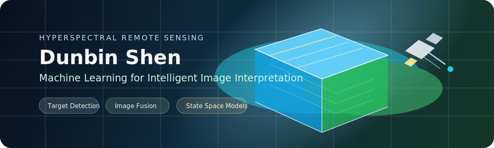
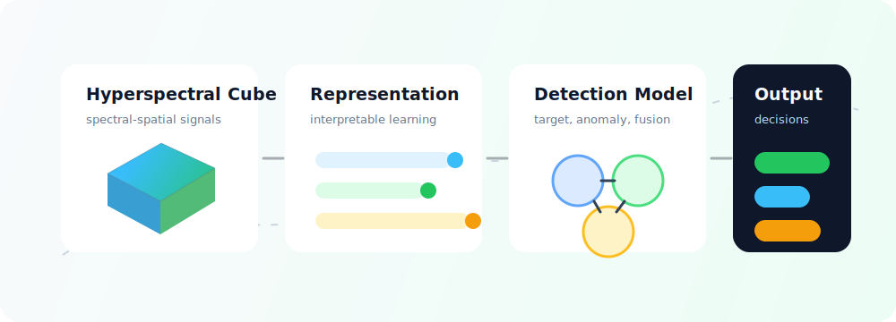

  

<h1 align="center">Dunbin Shen</h1>

  

  
  
  

  
  
  

---

### Research Snapshot

<table>
  <tr>
    <td width="58%">
      <b>About me</b>
        
      I am a Ph.D. candidate in Signal and Information Processing at Dalian University of Technology, advised by Prof. Hongyu Wang.
        
      My work focuses on machine learning and pattern recognition for hyperspectral remote sensing, with an emphasis on target detection, anomaly detection, image fusion, and intelligent image interpretation.
    </td>
    <td width="42%">
      
    </td>
  </tr>
</table>

### Focus Areas

  
  
  
  
  
  

### Academic Highlights

  

<table>
  <tr>
    <td align="center"><b>6</b> First-author papers</td>
    <td align="center"><b>5</b> First-author SCI papers</td>
    <td align="center"><b>3</b> CAS Q1 Top papers</td>
    <td align="center"><b>1</b> ESI Highly Cited Paper</td>
  </tr>
  <tr>
    <td align="center"><b>NSFC</b> Project participation</td>
    <td align="center"><b>IEEE TGRS</b> Journal publications</td>
    <td align="center"><b>IEEE JSTARS</b> Journal publications</td>
    <td align="center"><b>Reviewer</b> International journals</td>
  </tr>
</table>

### Selected Publications

<table>
  <tr>
    <td width="50%">
      <b>HTD-Mamba</b> 
      Efficient Hyperspectral Target Detection With Pyramid State Space Model  
      
      
      
        
      DOI: <a href="https://doi.org/10.1109/TGRS.2025.3544720">10.1109/TGRS.2025.3544720</a>
    </td>
    <td width="50%">
      <b>Interpretable Representation Network</b> 
      Hyperspectral Target Detection Based on Interpretable Representation Network  
      
      
        
      DOI: <a href="https://doi.org/10.1109/TGRS.2023.3302950">10.1109/TGRS.2023.3302950</a>
    </td>
  </tr>
  <tr>
    <td width="50%">
      <b>ADMM-HFNet</b> 
      A Matrix Decomposition-Based Deep Approach for Hyperspectral Image Fusion  
      
      
        
      DOI: <a href="https://doi.org/10.1109/TGRS.2021.3112181">10.1109/TGRS.2021.3112181</a>
    </td>
    <td width="50%">
      <b>SSBDM</b> 
      Spectral-Spatial Bilinear Decomposition for Hyperspectral Target Detection  
      
      
        
      DOI: <a href="https://doi.org/10.1109/JSTARS.2026.3670876">10.1109/JSTARS.2026.3670876</a>
    </td>
  </tr>
</table>

### Research Projects

<table>
  <tr>
    <td width="33%">
      <b>Cross-Dataset HSI Classification</b>  
      Information mining and sharing for robust hyperspectral classification.
    </td>
    <td width="33%">
      <b>Rail Transit Perception</b>  
      Hyperspectral rail fault detection for multimodal intelligent sensing.
    </td>
    <td width="33%">
      <b>Aircraft Target Detection</b>  
      Weak-prior target detection using hyperspectral remote sensing satellite data.
    </td>
  </tr>
</table>

### Tools I Use

  

### GitHub Activity

  
  

  

---

  <b>Open to academic communication and collaboration in hyperspectral remote sensing and intelligent image interpretation.</b>

