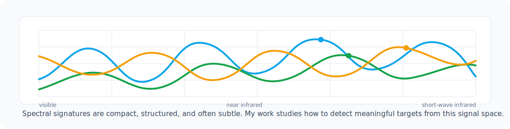

<h1 align="center">Dunbin Shen</h1>

  Ph.D. Candidate, Signal and Information Processing 
  Dalian University of Technology

  <a href="mailto:sdb_2012@163.com">Email</a> /
  <a href="https://github.com/shendb2022?tab=repositories">Repositories</a>

  

### About

I work on machine learning methods for hyperspectral remote sensing, with a focus on target detection, anomaly detection, image fusion, and intelligent image interpretation.

My current research is centered on a simple question: how can we make models more reliable when targets are weak, spectra are mixed, and annotated samples are limited? I am especially interested in interpretable representation learning, matrix decomposition, sparse modeling, deep unfolding, and state space models for hyperspectral image analysis.

### Research Interests

| Direction | What I Study |
| --- | --- |
| Hyperspectral target detection | Weak target discovery, background suppression, spectral-spatial modeling |
| Hyperspectral image fusion | Deep unfolding, matrix decomposition, multisource image reconstruction |
| Anomaly detection | Low-rank and sparse modeling, tensor approximation, nonlocal priors |
| Cross-scene interpretation | Domain adaptation, cross-dataset classification, few-shot learning |

### Selected Publications

**HTD-Mamba: Efficient Hyperspectral Target Detection With Pyramid State Space Model**  
IEEE Transactions on Geoscience and Remote Sensing, 2025  
First author. CAS Q1 Top. ESI Highly Cited Paper.  
[DOI: 10.1109/TGRS.2025.3544720](https://doi.org/10.1109/TGRS.2025.3544720)

**Hyperspectral Target Detection Based on Interpretable Representation Network**  
IEEE Transactions on Geoscience and Remote Sensing, 2023  
First author. CAS Q1 Top.  
[DOI: 10.1109/TGRS.2023.3302950](https://doi.org/10.1109/TGRS.2023.3302950)

**ADMM-HFNet: A Matrix Decomposition-Based Deep Approach for Hyperspectral Image Fusion**  
IEEE Transactions on Geoscience and Remote Sensing, 2022  
First author. CAS Q1 Top.  
[DOI: 10.1109/TGRS.2021.3112181](https://doi.org/10.1109/TGRS.2021.3112181)

**SSBDM: A Spectral-Spatial Bilinear Decomposition Model with Adaptive Multi-Kernel Dictionary for Hyperspectral Target Detection**  
IEEE Journal of Selected Topics in Applied Earth Observations and Remote Sensing, 2026  
First author.  
[DOI: 10.1109/JSTARS.2026.3670876](https://doi.org/10.1109/JSTARS.2026.3670876)

**A Twice Optimizing Net With Matrix Decomposition for Hyperspectral and Multispectral Image Fusion**  
IEEE Journal of Selected Topics in Applied Earth Observations and Remote Sensing, 2020  
First author.  
[DOI: 10.1109/JSTARS.2020.3007413](https://doi.org/10.1109/JSTARS.2020.3007413)

### Research Record

| Area | Summary |
| --- | --- |
| Publications | 6 first-author academic papers, including 5 SCI papers and 1 international conference paper |
| Representative results | 3 first-author CAS Q1 Top journal papers; 1 ESI Highly Cited Paper |
| Projects | Participated in NSFC, Dalian key discipline, and aerospace innovation projects |
| Academic service | Reviewer for ISPRS JPRS, IEEE TGRS, IEEE JSTARS, IJDE, IJRS, and Advances in Space Research |

### Project Experience

**Cross-dataset hyperspectral image classification**  
Designed and evaluated algorithms for information mining and sharing across hyperspectral datasets.

**Multimodal intelligent perception for rail transit**  
Worked on hyperspectral rail fault detection algorithms and experimental validation.

**Aircraft target detection using hyperspectral satellite data**  
Studied low-resolution spectral unmixing and weak-prior target detection for airborne targets.

### Tools

  

### GitHub

  
  

---

  Open to academic communication and collaboration in hyperspectral remote sensing.

